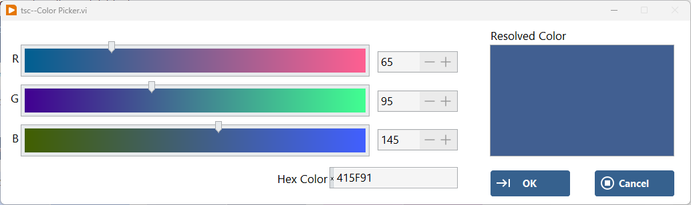

# tsc-material-theme

Find the VIP here:  

This code is based on Google's Material 3: https://m3.material.io

It implements the theory and application of color schemes to LabVIEW front panels. Installing the **VIP** file will add two menu items to the LabVIEW Tools bar:

    Tools->TSC->Convert Material JSON to LabVIEW Theme...
    Tools->TSC->Edit a Button--Material...

## Convert Material JSON to LabVIEW Theme
The following interface shows the UI that can be accessed in order to verify the settings of the exported **Material JSON file** settings for the color levels and themes. The tabs show the top level scheme application, the palette variations, and the raw JSON text that can be verified.

**Note:** The theme JSON file can be created at <https://material-foundation.github.io/material-theme-builder/> or using other Material helper tools such as Figma 

Press the **preview** button to see an example UI that includes many different types of LabVIEW front panel controls that apply the theme. To see the color code information (r,g,b) and xHex - hover mouse over the colorbox. `Click` to change.

Save the theme for use in LabVIEW with the **disk** FAB or using `Ctrl+S`. For the TSC Material Theme application, the data is saved in a flattened XML file using LabVIEW classes.

### UPDATED CONVERTER v2.2.0!
 

`New Feature Alert` : also use the Color Picker tool to directly enter a hex color code or adjust the colors with slider bar inputs.

 

## Button Editor UI
Launch the Button Editor UI to create new buttons following the theme rules easily and quickly. Choose a theme file (`.xml`) and then make choices for the theme type, the color level, the button family, and the button type to see a preview of all changes made. Colors for the six Boolean Actions (`False, True, Click when False, Click when True, Hover when False, and Hover when True`) will load directly from the Material rules, but can be edited. Change other aspects for the Boolean as desired and save when ready. 

**Note:** Hover and click actions will all be visible in the preview pane!

When a mutliple-image type is chosen, there will be paths to load in choices for all `FOUR` button images (`False, True, Click when False, and Click when True`).

## Apply Theme to LabVIEW Code
There are two main VIs used to apply the LabVIEW theme to a given VI
    
### Load Material Theme.vi
 

    Provide an input path to the **file path** (.xml extension)

### Apply UI Theme.vi
 

    Provide a reference to the VI to update theme colors
    Choose the Theme Level selection
    Provide option to SAVE the VI

## In Use Info:
Using the automatic coloring involves setting the "Control UI Level" and if it is a Boolean, the "Button Type". This is set by right-clicking on the different front panel objects.

**Note:** Right clicking on a Boolean control will also give the developer the ability to easily change the Boolean image(s) and/or Image(s) color!

**Note:** Save the VI after setting any of these options

 
 

## Control UI Theme Level:
The `Control UI Theme Level` is saved as part of the meta-data of a VI using **tags**

### tag name : control-type

### Values:

- Primary
- Secondary
- Tertiary
- Error
- Primary Fixed
- Secondary Fixed
- Tertiary Fixed
- Label Only
- N/A or No Change

## Button Description of Type:
The `Boolean Type Level` is saved as part of the meta-data of a VI using **tags**

### tag name : button-type

### Values:

- N/A
- Outline
- No-Outline
- Tonal
- Filled
- Transparent
- FAB
- Elevated
