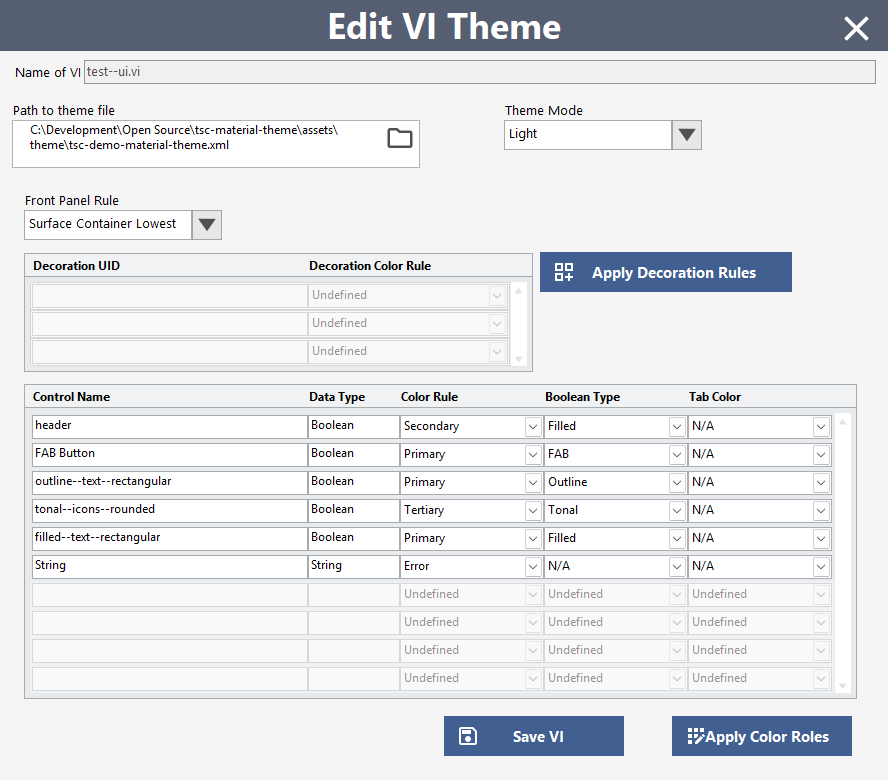
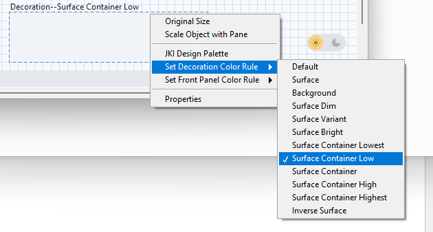
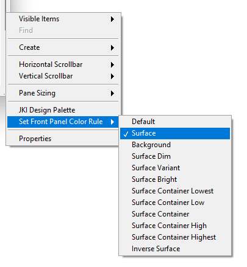

# tsc-material-theme

Find the VIP here:  

This code is based on Google's Material 3 User Interface Coloring/Design Guidelines: https://m3.material.io

It implements the theory and application of color schemes to LabVIEW front panels. Installing the **VIP** file will add **FOUR** menu items to the LabVIEW Tools bar:

[Tools->TSC->Edit VI Theme...](#edit-vi-theme) 
    Can also be invoked by Quick Drop Shortcut! `Ctrl+C` by default  
[Tools->TSC->Edit a Button--Material...](##button-editor-ui)  
[Tools->TSC->Material Theme Editor...](#material-theme-editor)  
[Tools->TSC->View VI's Color Palette](#color-palette-ui)

## Edit VI Theme
Select the coloring rules for:
 - Front Panel
 - Decorations
 - All Controls/Indicators
    - Color Rule
    - Boolean Type (if applicable)
    - Tab Color (if applicable)
#### 💾 Save the VI to keep metadata of Theme File and Theme Mode!
 

## Button Editor UI
Launch the Button Editor UI to create new buttons following the theme rules easily and quickly. Choose a theme file (`.xml`) and then make choices for the theme type, the color level, the button family, and the button type to see a preview of all changes made. Colors for the six Boolean Actions (`False, True, Click when False, Click when True, Hover when False, and Hover when True`) will load directly from the Material rules, but can be edited. Change other aspects for the Boolean as desired and save when ready. 

**Note:** Hover and click actions will all be visible in the preview pane!

When a mutliple-image type is chosen, there will be paths to load in choices for all `FOUR` button images (`False, True, Click when False, and Click when True`).

#### 💡 The *Glyphs* tab allows user to define an image library to easily drag and drop glyphs to buttons!  
#### 📚 Reference https://github.com/danielcoons/material-icons-toolkit as a place to get easy access to the Archive of PNG images of the Google Material Library!

## Material Theme Editor
The following interface shows the UI that can be accessed in order to verify the settings of the exported **Material JSON file** settings for the color levels and themes or load in previously saved theme files. The tabs show the top level scheme application, the palette variations, the raw JSON text, and examples of Button Types with this theme.

#### 💡 The theme JSON file can be created at <https://material-foundation.github.io/material-theme-builder/> or using other Material helper tools such as Figma 

Press the **preview** button to see an example UI that includes many different types of LabVIEW front panel controls that apply the theme. To see the color code information (r,g,b) and xHex - hover mouse over the colorbox. `Click` to change.

Save the theme for use in LabVIEW with the **disk** FAB or using `Ctrl+S`. For the TSC Material Theme application, the data is saved in a flattened XML file using LabVIEW classes.

Click on the **color palette** button to see the list of colors for this theme in the new interface which allows for import into LabVIEW's `User Colors` see [here](#color-palette-ui) for more details!

 

## Color Palette UI
The color palette UI gives easy access to all color rules/levels in the theme file and theme mode that are saved with a VI or selected the Material Theme Editor interface.

Additionally, developers can use this window to:
 - Export the selected colors (up to 18) to the LabVIEW `User Colors` 
    - The ability to set these can also be updated by going to the `Environment` Category of the LabVIEW Options Menu and selecting `Custom Colors...`
    - When saving through the VI, LabVIEW must be restarted to apply the update

- Easily access to the colors for copy and paste (when Stopping the VI using the button)
- See the HEX codes for all colors in the theme
- Restore the LabVIEW defaults if no longer wanting the colors to be applied from the theme
 

When colors are exported to the `User Colors`, they can be accessed directly in the color picker tools with the `Tools Palette`
 

## Apply Theme to LabVIEW Code Dynamically
There are two main VIs used to apply the LabVIEW theme to a given VI
    
### Load Material Theme.vi
 

    Provide an input path to the **file path** (.xml extension)

### Apply UI Theme.vi
 

    Provide a reference to the VI to update theme colors
    Choose the Theme Level selection
    Provide option to SAVE the VI

## ✨ Edit Time Menus
Using the automatic coloring involves setting the color rules to a control, indicator, panel, or decoration. These rules can be applied broadly with the Edit VI Theme action or through right click menus. All data is saved as part of the **tag** data of a control.

#### 💡 **Note:** Right clicking on a Boolean control will also give the developer the ability to easily change the Boolean image(s) and/or Image(s) color!

#### 💡 **Note:** Save the VI after setting any of these options

### Control Color Rule:
 

### Button Description of Type:
Defines the `Boolean Type Level` (which is how coloring decisions are made)

 

### Tab Control Rules:

 

### Decoration Rules:

 

### Front Panel Rules:

 